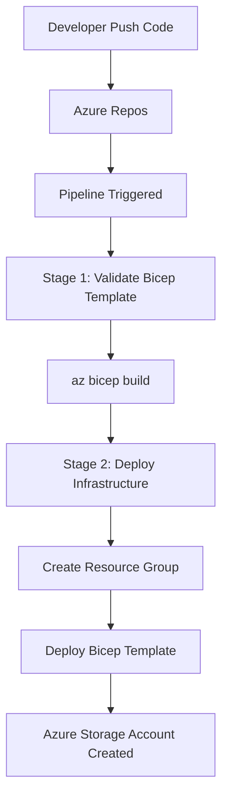

# Azure DevOps CI/CD Pipeline for Infrastructure as Code using Bicep

## Project Overview

This project demonstrates a **complete CI/CD pipeline using Azure DevOps to deploy Infrastructure as Code (IaC) with Bicep**.

The pipeline automatically validates and deploys Azure infrastructure whenever code changes are pushed to the repository.

Infrastructure deployed in this project:

* Azure Resource Group
* Azure Storage Account

This project shows how DevOps practices enable **automated, repeatable, and version-controlled infrastructure deployments**.

---

# Architecture

The following diagram shows the overall architecture of the system.


---

# CI/CD Workflow

The workflow below explains the pipeline execution process.



---

# Repository Structure

```
azure-devops-bicep-iac-pipeline
│
├── bicep
│   ├── main.bicep
│   └── parameters.json
│
├── pipelines
│   └── azure-pipelines.yml
│
├── screenshots
│   ├── Azure Resource Group + Storage Account.png
│   ├── Pipeline stages view.png
│   ├── pipeline.png
│   └── Repo structure in Azure Repos.png
│
└── README.md
```

---

# Bicep Infrastructure

The Bicep template creates an **Azure Storage Account inside a Resource Group**.

Main template file:

```
bicep/main.bicep
```

Parameter file:

```
bicep/parameters.json
```

The parameters file contains values used during deployment.

---

# CI/CD Pipeline

Pipeline configuration file:

```
pipelines/azure-pipelines.yml
```

The pipeline performs two main stages.

---

## Stage 1 — Validate Bicep

This stage validates the Bicep template.

```
az bicep build --file bicep/main.bicep
```

This ensures the infrastructure code compiles successfully.

---

## Stage 2 — Deploy Infrastructure

This stage deploys Azure resources.

```
az group create
az deployment group create
```

Deployment results in:

Resource Group

```
bicep-rg
```

Storage Account

```
devopsbicepsa001
```

Location

```
East US
```

---

# Pipeline Trigger Configuration

The pipeline automatically triggers when changes are pushed to the `main` branch.

However, documentation updates should not trigger deployments.

```
trigger:
  branches:
    include:
      - main
  paths:
    exclude:
      - README.md
```

This prevents unnecessary pipeline executions.

---


# Screenshots

## Pipeline Execution


---

## Pipeline Stages View


---

## Azure Resource Deployment


---

## Repository Structure in Azure Repos


---

# Technologies Used

* Azure DevOps
* Azure Repos
* Azure Pipelines
* Bicep
* Azure CLI
* Git
* Infrastructure as Code (IaC)

---

# DevOps Concepts Demonstrated

* Infrastructure as Code (IaC)
* Automated CI/CD pipelines
* Cloud infrastructure automation
* YAML pipeline configuration
* Version-controlled deployments

---

# Author

**Pavan Kumar Gummadi**
DevOps Engineer
