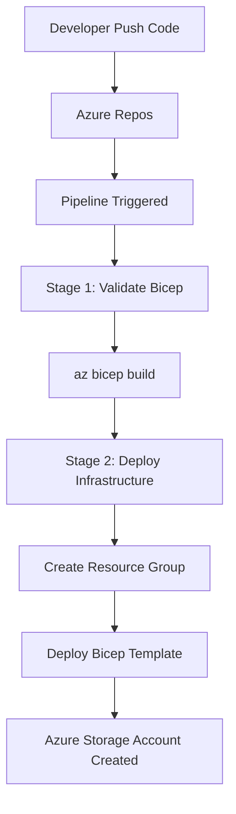
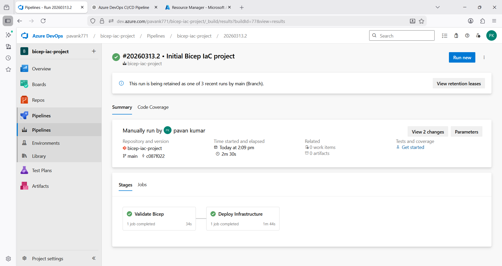

# Azure DevOps CI/CD Pipeline for Infrastructure as Code using Bicep

## Project Overview

This project demonstrates a **complete Azure DevOps CI/CD pipeline that deploys Infrastructure as Code (IaC) using Bicep**.

The pipeline automatically validates and deploys Azure infrastructure whenever code changes are pushed to the repository.

Infrastructure deployed in this project:

* Azure Resource Group
* Azure Storage Account

The project demonstrates how DevOps practices enable **automated, repeatable, and version-controlled infrastructure deployments**.

---

# Architecture

The architecture below shows how the developer, Azure DevOps pipeline, and Azure infrastructure interact.


---

# CI/CD Workflow

The following workflow explains the full pipeline process.



---

# Repository Structure

```
azure-devops-bicep-iac-pipeline
│
├── bicep
│   ├── main.bicep
│   └── parameters.json
│
├── pipelines
│   └── azure-pipelines.yml
│
├── screenshots
│   ├── Pipeline stages view.png
│   ├── pipeline.png
│   ├── Azure Resource Group + Storage Account.png
│   └── Repo structure in Azure Repos.png
│
└── README.md
```

---

# Bicep Infrastructure Template

The Bicep template creates a **Storage Account inside a Resource Group**.

Main template:

```
bicep/main.bicep
```

This template defines:

* Storage Account
* Location
* SKU configuration

Parameters are provided using:

```
bicep/parameters.json
```

---

# CI/CD Pipeline

Pipeline configuration file:

```
pipelines/azure-pipelines.yml
```

The pipeline performs the following tasks.

## Stage 1 – Validate Bicep

The Bicep template is validated before deployment.

```
az bicep build --file bicep/main.bicep
```

This ensures the template compiles correctly.

---

## Stage 2 – Deploy Infrastructure

The pipeline then deploys infrastructure using Azure CLI.

```
az group create
az deployment group create
```

Deployment results in the creation of:

* Resource Group: `bicep-rg`
* Storage Account: `devopsbicepsa001`

---

# Pipeline Trigger Rules

The pipeline automatically runs when code changes are pushed to the `main` branch.

However, documentation updates do not trigger deployments.

```
trigger:
  branches:
    include:
      - main
  paths:
    exclude:
      - README.md
```

This prevents unnecessary pipeline runs.

---

# Deployment Result

After a successful pipeline execution, the following resources are created in Azure:

Resource Group
`bicep-rg`

Storage Account
`devopsbicepsa001`

Region
`East US`

---

# Screenshots

## Pipeline Execution



---

## Pipeline Stages


---

## Azure Resource Deployment


---

## Repository Structure


---

# Technologies Used

* Azure DevOps
* Azure Repos
* Azure Pipelines
* Bicep
* Azure CLI
* Git
* Infrastructure as Code (IaC)

---

# Key DevOps Concepts Demonstrated

* Infrastructure as Code
* Automated CI/CD pipelines
* YAML pipeline configuration
* Cloud resource automation
* Version-controlled infrastructure

---

# Author

**Pavan Kumar Gummadi**

DevOps Engineer
